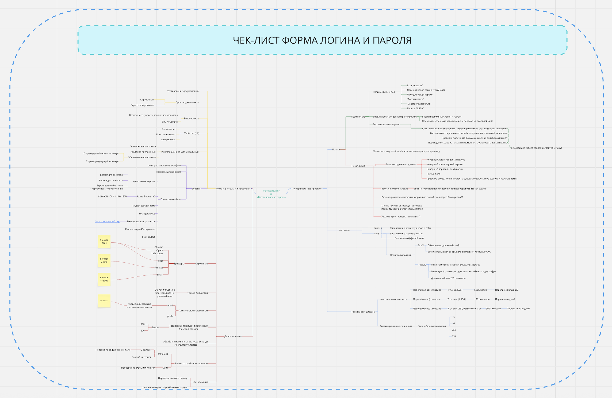

# Documentation

# Пример чек-лист

https://miro.com/app/board/uXjVIO6Nwzw=/?share_link_id=584508071429

# Пример баг-репорт

## [bug][web][прод] В корзине при клике на ссылку "Continue Shopping" ничего не происходит

## Описание

При нажатии на ссылку "Continue Shopping" ничего не происходит

## Шаги воспроизведения

* Зайти на сайт   https://-----------/
* Добавить любой товар в "Корзину"
* Перейти в "Корзину"
* Попытаться кликнуть на ссылку "Continue Shopping"

## Текущий результат

Ничего не происходит

## Ожидаемый результат

Переход на страницу выбора товаров

## Окружение

* Прод
* Браузер Google Chrome Версия 133.0.6943.142 (Официальная сборка)
* Браузер Safari Версия 18.3 (20620.2.4.11.5) (Официальная сборка)
  
## Тестовые устройства

Macbook 15 2024 m3 Sequoia 15.3.1

## Исполнитель

_______________

## Наблюдатели

_______________

## Статус

Бэклог

## Дата создания

01.01.2025

## Приоритет

Низкий

## Аналитика

Если бы я у вас работал, то приложил бы статистику из яндекс метрики о том, сколько пользователей задела проблема

## Документация

Если бы я у вас работал, то прикрепил бы ссылку на требования: вики или фигму

## Ссылка на тред

Если бы я у вас работал, то приложил ссылку на тред с обсуждением этого дефекта
